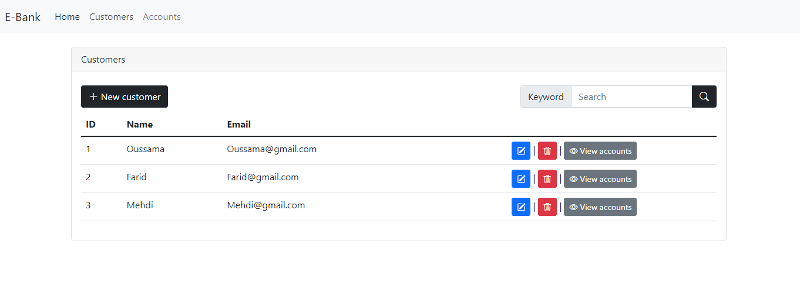
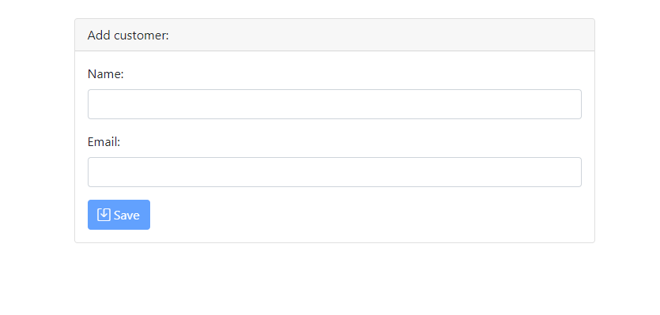
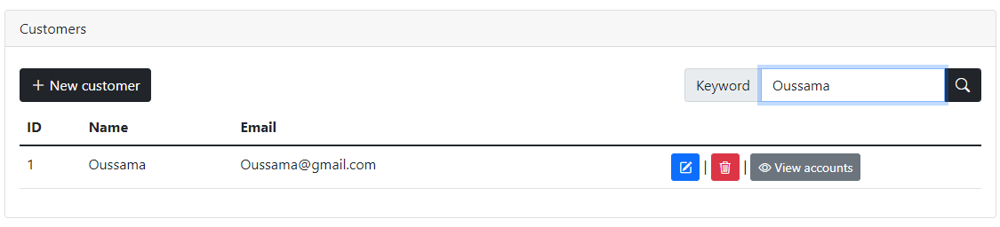
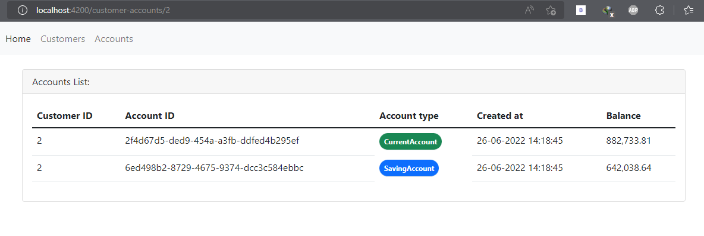
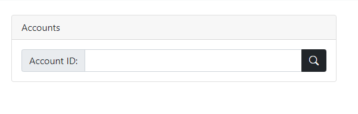
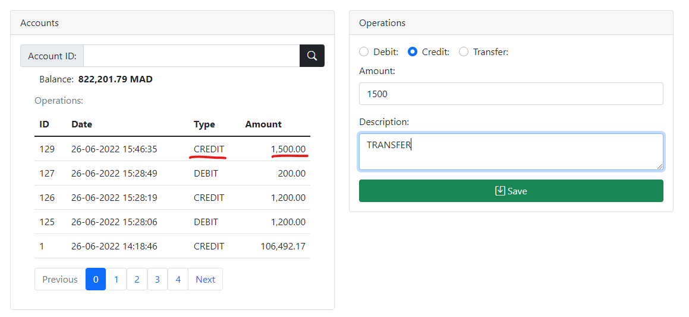

## Gestion des Comptes Bancaires (ANAS ANASRI)

### Description

Ce projet vise à développer une application permettant de gérer des comptes bancaires. Chaque compte appartient à un client et peut subir plusieurs opérations de type DEBIT ou CREDIT. Les deux types de comptes pris en charge sont les Comptes Courants et les Comptes Épargne.

### Architecture en Couches

L'application suivra une architecture en couches pour assurer une séparation claire des responsabilités et faciliter la scalabilité et la maintenabilité du code. Les principales couches incluent :

- **Couche DAO (Data Access Object)** : Cette couche est responsable de l'accès aux données et de la communication avec la base de données. Elle utilise les entités JPA (Java Persistence API) pour représenter les objets métier.

- **Couche Service** : Cette couche gère la logique métier de l'application. Elle utilise les DAOs pour accéder aux données, effectuer des opérations et traiter les règles métier.

- **Couche Présentation** : Cette couche est chargée de présenter les données à l'utilisateur et de recevoir les entrées de l'utilisateur. Elle comprend les RestControllers qui exposent une API REST pour interagir avec l'application.

- **Couche Front-end** : Cette couche concerne l'interface utilisateur et sera développée en utilisant le framework Angular.

### Installation

Pour exécuter l'application, suivez les étapes ci-dessous :

1. Clonez le dépôt du projet en utilisant la commande : `git clone https://github.com/MarshelD/E_Bank`
2. Accédez au dossier backend : `cd backend`
3. Importez le projet backend dans votre IDE préféré, tel que Eclipse ou IntelliJ.
4. Exécutez le projet backend en cliquant sur le bouton "Run" de votre IDE. Assurez-vous d'avoir configuré correctement votre environnement Java et Maven pour exécuter un projet Spring Boot.
5. Accédez au dossier frontend : `cd ../frontend`
6. Installez les dépendances en utilisant la commande : `npm install`
7. Lancez l'application frontend en utilisant la commande : `npm start`. Assurez-vous d'avoir Node.js et Angular CLI installés sur votre machine pour exécuter l'application frontend.

### Structure du Projet

Le projet est organisé en deux parties distinctes :

1. Backend : développé en utilisant le framework Spring Boot, cette partie comprend les couches DAO, Service et les RestControllers. Le code source du backend se trouve dans le dossier "backend".

2. Frontend : développé en utilisant Angular, cette partie concerne l'interface utilisateur de l'application. Le code source du frontend se trouve dans le dossier "frontend".

### Contributions

Les contributions sont les bienvenues ! Si vous souhaitez contribuer à ce projet, veuillez consulter le fichier CONTRIBUTING.md pour obtenir des instructions détaillées. Toutes les formes de contributions, telles que les corrections de bugs, les améliorations de fonctionnalités ou les suggestions d'amélioration de l'expérience utilisateur, sont appréciées.

Nous espérons que vous apprécierez notre application de gestion des comptes bancaires. N'hésitez pas à nous contacter si vous avez des questions ou des commentaires. Bonne utilisation !

<h3>Customers interface</h3>

<h5>Add, edit, delete, search and view accounts list for each customer</h5>

<h6>Add customer interface</h6>

<h6>Edit customer interface</h6>

<h6>Search for a customer by name</h6>

<h6>Customer accounts</h6>

<h3>Accounts & operations interface</h3>

<h5>Search for an account by ID</h5>

<h5>Account and all its operations</h5>

<h6>We have different types of operations(Debit, Credit, Transfer): </h6>

